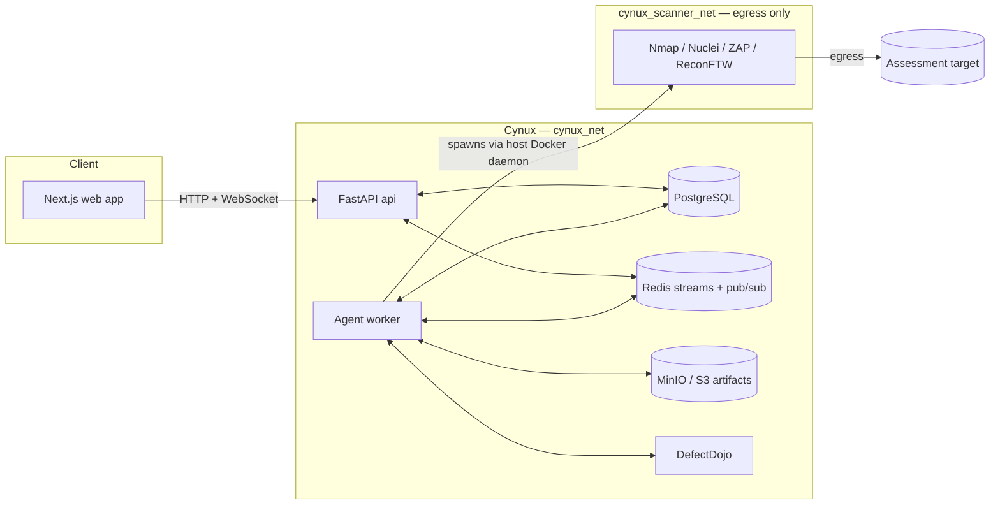

# Cynux

AI-powered security assessment platform. You give it a plain-language objective
("assess the security posture of staging.example.com"); a LangGraph agent
interprets it, runs **passive** reconnaissance, discovers assets, and then
**stops and waits for a human to approve** what gets actively scanned. On
approval it runs Nmap / Nuclei / OWASP ZAP inside locked-down containers, imports
the results into **DefectDojo** (the authoritative vulnerability store), enriches
them with threat intelligence (NVD, CISA KEV, EPSS, MISP), prioritises
deterministically, drafts **advisory-only** remediation, and can file Jira
tickets, notify Slack/email, and render a report.

> **Project status.** The backend (agent, scanners, integrations, services,
> API), the web frontend (`frontend/`), and this full self-hosted stack are all
> in place and pass their offline gates. What has **not** been done for you is a
> live end-to-end run: the stack must be brought up on a Docker host with your own
> secrets (LLM key, DefectDojo token) before it does anything. The Quickstart
> below is that bring-up. `make up` starts the whole system including the web app;
> `make up-backend` starts everything except the frontend if you prefer to drive
> the REST API directly.

---

## Architecture



**The assessment lifecycle** (with the human-in-the-loop gate that defines the
product):

1. Operator submits an objective and attests they are authorised to test the
   target (FR-006).
2. Agent interprets the objective and plans.
3. **Passive** recon + asset discovery only (nothing that touches the target
   intrusively, FR-008).
4. **STOP → human approval (FR-011).** The agent surfaces the discovered assets
   and its proposed active-scan plan. Scanning does **not** proceed until an
   operator approves; the approved payload is the sole authority for what runs.
5. Active scanners run in isolated containers (SEC-004).
6. Findings are imported into **DefectDojo**, which owns parsing, dedup and
   vulnerability state (FR-016/017/018) — Cynux never re-implements that.
7. Threat-intel enrichment; unreachable feeds report `UNAVAILABLE` rather than a
   false negative (FR-020).
8. Deterministic prioritisation, then advisory-only AI remediation where every
   claim cites its evidence (FR-024/025).
9. Optional Jira tickets, Slack/email notifications, and a rendered report.

**Services** (see [`docker-compose.yml`](docker-compose.yml)):

| Service | Purpose |
| --- | --- |
| `postgres` | Application database |
| `redis` | Agent run stream + event pub/sub |
| `minio` / `minio-init` | S3-compatible artifact store; init creates the bucket |
| `migrate` | Runs `alembic upgrade head` once, then exits |
| `api` | FastAPI app (`/healthz`, `/readyz`, REST, WebSocket) |
| `worker` | LangGraph agent worker; spawns scanner containers |
| `frontend` | Next.js web app |
| `defectdojo-*` | Bundled DefectDojo stack (compose profile `defectdojo`) |

**Network isolation (SEC-004).** App and data services share `cynux_net`. The
scanner containers the worker launches join `cynux_scanner_net`, which **no data
service is attached to** — a compromised scanner image cannot reach Postgres,
Redis, or MinIO. That network still has egress, because scanners must reach the
target under assessment.

---

## Prerequisites

- **Docker** with the **Compose v2** plugin (`docker compose version`).
- An **LLM API key** — Anthropic by default. This is the one value you must
  supply by hand; Cynux ships with no default provider and the worker refuses to
  start without one.
- **GNU Make** is optional but convenient. On Windows, run `make` from Git Bash,
  or run the underlying `docker compose ...` commands (shown by `make help`)
  directly.
- ~4 GB free RAM for the core stack; noticeably more if you also run the bundled
  DefectDojo.

---

## Quickstart

```bash
# 1. Create your .env from the template
make env

# 2. Set the one required secret: open .env and fill in
#    CYNUX_LLM__ANTHROPIC_API_KEY=sk-ant-...

# 3. Generate strong values for every other secret (JWT, Fernet key, DB/MinIO
#    passwords, DefectDojo secrets). Leaves your LLM key untouched.
make secrets

# 4. Bring up DefectDojo on its own and wait for it to initialise (~1-2 min the
#    first time — it migrates its own DB and creates the admin user).
make defectdojo-up
make ps            # wait until defectdojo-initializer has Exited (0)

# 5. Mint a DefectDojo API token and write it into .env automatically.
make defectdojo-token

# 6. Start Cynux.
make up            # full stack, including the web app at :3000
# ...or, to run the API/worker without the frontend:
make up-backend    # data plane + api + worker only
```

Then:

- API health: <http://localhost:8000/healthz> and <http://localhost:8000/readyz>
- API docs: <http://localhost:8000/docs>
- Frontend (when built): <http://localhost:3000>
- MinIO console: <http://localhost:9001>
- DefectDojo: <http://localhost:8080>

If you change `.env` afterwards, `make restart` rebuilds and restarts `api` and
`worker` so they pick up the new values.

### Using an external DefectDojo

You don't have to run the bundled DefectDojo. Point `CYNUX_DEFECTDOJO__BASE_URL`
and `CYNUX_DEFECTDOJO__API_TOKEN` at your own instance, skip
`make defectdojo-up` / `make defectdojo-token`, and just `make up-backend`.

---

## Configuration

[`.env.example`](.env.example) is the single source of truth for configuration —
every variable is documented there and mirrors the settings contract in
`backend/app/core/config.py`. Conventions:

- Prefix everything with `CYNUX_`.
- Nested groups use a double underscore: `CYNUX_DB__PASSWORD`,
  `CYNUX_SCANNER__MEMORY_LIMIT_MB`, and so on.
- List values accept CSV or JSON.

The API and worker validate their configuration at startup and **fail fast** with
a clear message if a required secret is missing. Required in every environment:
`CYNUX_SECURITY__JWT_SECRET` (≥ 32 chars), `CYNUX_SECURITY__CREDENTIAL_ENCRYPTION_KEY`
(Fernet key), `CYNUX_DB__PASSWORD`, and an LLM provider + key + model. The worker
additionally requires object storage and DefectDojo to be configured. `make
secrets` fills the first set for you; the LLM key and the DefectDojo token are the
two you provide.

### Production hardening

When `CYNUX_ENVIRONMENT=production`, startup validation additionally **refuses to
boot** if debug is on, if `*` appears in `CYNUX_CORS_ORIGINS` or
`CYNUX_ALLOWED_HOSTS`, if `CYNUX_PUBLIC_BASE_URL` is not HTTPS, or if DefectDojo
TLS verification is disabled. Set those correctly before deploying beyond
localhost.

---

## Make targets

Run `make help` for the full list. The ones you'll use most:

| Target | What it does |
| --- | --- |
| `make env` | Create `.env` from the template |
| `make secrets` | Regenerate all change-me secrets in `.env` (keeps your LLM key) |
| `make defectdojo-up` | Start only DefectDojo |
| `make defectdojo-token` | Mint a DefectDojo API token into `.env` |
| `make up` | Start the full stack |
| `make up-backend` | Start the backend only (no frontend) |
| `make restart` | Rebuild + restart `api` and `worker` |
| `make logs` | Tail all logs |
| `make ps` | Service status |
| `make migrate` | Run DB migrations once |
| `make down` / `make down-v` | Stop (keep / delete volumes) |
| `make backend-gate` | Offline backend gate: verify + ruff + mypy |

---

## Security notes for operators

- **Only run this against systems you are authorised to test.** The approval gate
  (step 4 above) is a deliberate control, not a formality — active scanning is
  driven solely by what a human approves.
- **Scanner isolation (SEC-004).** Scanner containers run read-only, non-root,
  with dropped capabilities, no new privileges, and CPU/memory/PID limits, on an
  egress-only network with no route to your data services. Only a fixed set of
  pinned scanner images may be launched.
- **The Docker socket.** By default the `worker` service mounts
  `/var/run/docker.sock` and runs as root so it can launch sibling scanner
  containers via the host daemon. This grants the worker host-level control of
  Docker — acceptable for a single-tenant self-hosted deployment, but for a
  hardened setup put a Docker socket proxy in front of it and set
  `CYNUX_SCANNER__DOCKER_HOST=tcp://docker-proxy:2375`, then drop the root
  override and socket mount.
- **Artifact mount.** The worker bind-mounts `CYNUX_ARTIFACT_HOST_DIR` at the
  same path inside the container on purpose: that path is handed to the host
  daemon as the bind source for scanner containers, and a bind source is always
  resolved on the host. Keep the two equal.
- **Local MinIO and SSE.** `.env.example` sets `CYNUX_STORAGE__SSE=` (empty) so
  uploads work against KMS-less local MinIO. For real S3, set it to `AES256` (or
  configure KMS).
- **Credentials** are encrypted at rest with a Fernet key and are never logged,
  echoed in errors, or sent to the LLM.

---

## Repository layout

```
backend/        FastAPI app, LangGraph agent, scanners, integrations, services
  app/          application code (config, db, agent, api, scanners, services, ...)
  alembic/      database migrations
  tools/        offline gate (verify.py)
frontend/       Next.js 15 web app
docker/         Dockerfiles + operator helper scripts
docker-compose.yml
.env.example    configuration contract
Makefile        operator entrypoint
```

## Troubleshooting

- **`worker` keeps restarting** — almost always missing config: no LLM key, or
  DefectDojo not yet configured. Check `make logs` for the fail-fast message,
  confirm you ran `make defectdojo-token`, then `make restart`.
- **`make defectdojo-token` says it can't reach DefectDojo** — DefectDojo isn't
  finished initialising. Run `make ps` and wait until `defectdojo-initializer`
  shows `Exited (0)`, then retry.
- **Port already in use** — override the published port in `.env`
  (`CYNUX_API_PORT`, `CYNUX_FRONTEND_PORT`, `DEFECTDOJO_PORT`, `CYNUX_POSTGRES_PORT`,
  `CYNUX_MINIO_API_PORT`, `CYNUX_MINIO_CONSOLE_PORT`).
- **`api` is up but `/readyz` returns 503** — the database isn't reachable yet;
  `/readyz` is intentionally strict. `/healthz` (liveness) stays 200 regardless.
- **Reset everything** — `make down-v` removes all volumes (Postgres, Redis,
  MinIO, and DefectDojo data). Destructive; use when you want a clean slate.

